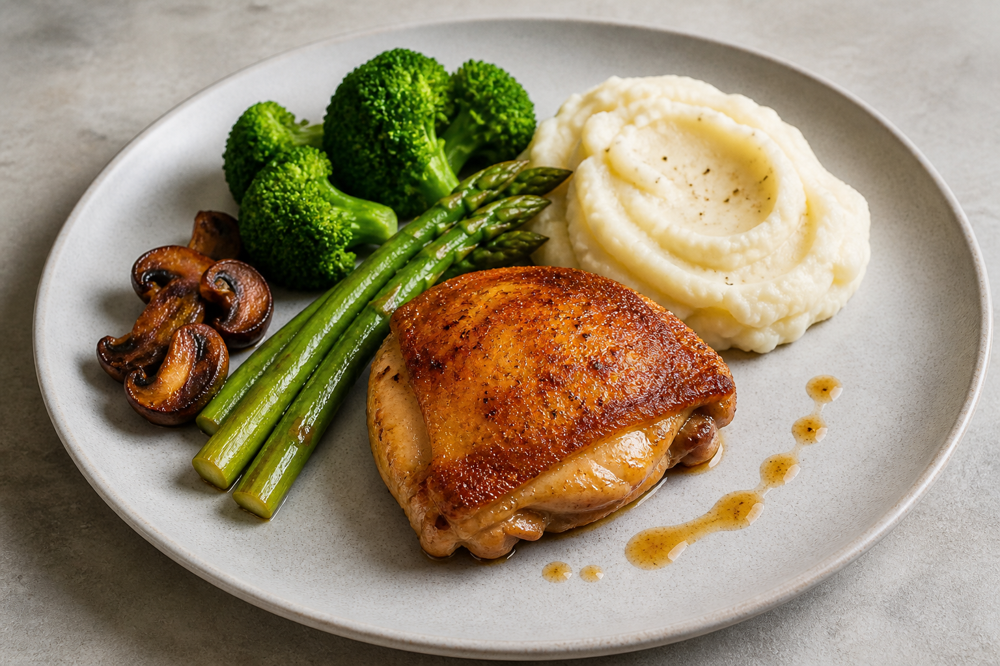

# 第 1 周｜香煎脆皮鸡腿排套餐

> 默认份量：2 人份  
> 课程用时：约 2 小时（首次制作建议预留 2.5 小时）  
> 难度：入门  
> 核心技法：鸡皮脆化、平底锅煎制、土豆泥、蔬菜熟度、基础锅汁、分区摆盘

> 图片用于摆盘方向参考，实际食材形态和成色以制作结果为准。

## 1. 本周成品

香煎脆皮鸡腿排，搭配普通奶油土豆泥、黄油芦笋、西兰花和焦香蘑菇，以少量鸡肉锅汁完成点缀。

这份餐盘不使用胡萝卜。鸡腿排与土豆泥分开摆放，酱汁只负责连接风味和画面，不铺满盘底。

## 2. 学习目标

完成本周后，应当能做到：

1. 通过擦干、冷藏风干和低温逼油获得较脆的鸡皮。
2. 不只依赖时间，而是结合声音、颜色、触感和中心温度判断火候。
3. 做出没有明显颗粒、不过稀也不过黏的奶油土豆泥。
4. 让芦笋和西兰花保持绿色与轻微脆感，让蘑菇形成焦香表面。
5. 用主次、颜色、高低和留白组织一个基础西餐餐盘。

## 3. 食材清单

### 主菜

| 食材 | 用量 | 说明 |
| --- | ---: | --- |
| 去骨带皮鸡腿 | 2 块，共约 450～520 g | 尽量选择大小、厚度接近的鸡腿 |
| 细盐 | 5 g | 约为鸡肉重量的 1%；若鸡肉较小可减至 4 g |
| 黑胡椒 | 1 g | 周五只放肉面，鸡皮面下锅前再少量添加 |
| 中性油 | 5 ml | 不粘锅可不放；不锈钢锅建议薄薄一层 |

### 奶油土豆泥

| 食材 | 用量 | 说明 |
| --- | ---: | --- |
| 粉质土豆 | 500 g | 去皮后约 430～450 g |
| 无盐黄油 | 50 g | 切小块 |
| 全脂牛奶 | 90 ml | 使用前加热 |
| 淡奶油 | 30 ml | 没有时用等量全脂牛奶替代 |
| 细盐 | 5 g 起 | 煮土豆的水另加盐，最终按口味调整 |
| 白胡椒或黑胡椒 | 少量 | 可选；白胡椒不会留下明显黑点 |

### 蔬菜

| 食材 | 用量 | 说明 |
| --- | ---: | --- |
| 芦笋 | 160 g，约 8～10 根 | 去除老根 |
| 西兰花 | 180 g | 切成大小接近的小朵 |
| 褐蘑菇或口蘑 | 200 g | 对半切；较大的切成四块 |
| 无盐黄油 | 35 g | 芦笋、西兰花和蘑菇共用 |
| 中性油 | 15 ml | 蘑菇与蔬菜煎炒使用 |
| 蒜 | 1 瓣 | 轻拍裂；不切末，避免焦苦 |
| 百里香 | 2 枝 | 可选 |
| 细盐 | 约 3 g | 分次使用 |
| 黑胡椒 | 少量 | 蘑菇使用 |

### 少量鸡肉锅汁

| 食材 | 用量 | 说明 |
| --- | ---: | --- |
| 红葱头或小洋葱 | 20 g | 切细末 |
| 无盐鸡高汤 | 120 ml | 使用低盐版本 |
| 干白葡萄酒 | 40 ml | 可选；不用时增加 40 ml 鸡高汤 |
| 无盐黄油 | 15 g | 冷藏，最后离火加入 |
| 柠檬汁 | 5 ml | 最后少量调整酸度 |
| 盐 | 少量 | 高汤收浓后再判断是否需要 |

## 4. 工具清单

### 必需

- 24～28 cm 厚底平底锅。
- 2 个锅：一个煮土豆，一个焯蔬菜；也可以清洗后复用同一口锅。
- 夹子或锅铲。
- 厨房纸。
- 削皮刀、厨师刀、砧板。
- 滤网。
- 压泥器或细孔滤网。
- 小奶锅或可加热牛奶的容器。
- 量杯或厨房秤。
- 两个温热的浅色平盘。

### 强烈建议

- 即时读数食品温度计。
- 晾架和托盘，用于鸡皮冷藏风干。
- 挤压瓶或小勺，用于控制锅汁用量。

### 不建议

- 用料理机或搅拌机打土豆泥：高速搅拌会释放过多淀粉，使口感发黏。
- 用热风吹风机处理鸡皮：厨房纸和冰箱无盖风干更容易控制，也更卫生。

## 5. 周五准备

### 5.1 鸡腿处理（10～15 分钟）

1. 检查鸡腿，剪去松散的多余脂肪，但保留完整鸡皮。
2. 将肉面较厚的位置轻轻划开或摊平，使整块厚度更接近；不要划破鸡皮。
3. 用厨房纸把鸡皮和肉面彻底按干。
4. 盐均匀撒在两面，黑胡椒先只撒肉面，避免鸡皮面煎制时胡椒焦苦。
5. 鸡皮朝上放在晾架上，置于托盘中，无盖冷藏 8～24 小时。
6. 将鸡肉放在冰箱最下层，与即食食物分开；接触生鸡肉的工具和台面立即清洗。

### 5.2 其他准备（约 15 分钟）

1. 核对黄油、牛奶、淡奶油和鸡高汤。
2. 清理蘑菇表面泥土，但先不要切。
3. 西兰花切成接近大小的小朵，彻底沥干后冷藏。
4. 准备两个温热用餐盘，并确认平底锅能同时放下两块鸡腿。

> 芦笋最好在制作当天去老根。土豆不要提前切开泡一整夜，以免风味和质地下降。

## 6. 周末制作时间线

首次制作建议把所有食材称量完成后再开火。

| 时间 | 工作 |
| --- | --- |
| 00:00～00:15 | 鸡腿短暂回温；处理土豆、芦笋、蘑菇、红葱头；烧两锅水 |
| 00:15～00:40 | 煮土豆；开始煎鸡腿的鸡皮面 |
| 00:35～00:55 | 鸡腿翻面并完成熟化；同时制作土豆泥 |
| 00:55～01:10 | 鸡腿静置；焦香蘑菇 |
| 01:10～01:20 | 用鸡肉锅底制作少量锅汁 |
| 01:15～01:30 | 焯西兰花和芦笋，再用黄油快速复热调味 |
| 01:30～01:40 | 检查温度、咸度和质地；温盘 |
| 01:40～01:50 | 按顺序摆盘并立即上桌 |
| 01:50～02:20 | 清理与记录本周复盘 |

## 7. 制作步骤

### 步骤 1｜回温与最终备料

1. 鸡腿从冰箱取出，保持鸡皮朝上放置 15～20 分钟；再次用厨房纸按干表面。
2. 土豆去皮，切成约 3 cm 的均匀块。
3. 芦笋掰去或切去老根；粗芦笋可削去底部约三分之一的外皮。
4. 蘑菇对半切，红葱头切细末。
5. 牛奶和淡奶油混合，小火加热至边缘冒热气，不要煮沸。

**完成判断：** 所有食材已经按使用顺序摆好，鸡皮摸起来干爽，没有明显水珠。

### 步骤 2｜煮土豆

1. 土豆放入锅中，加冷水至没过约 2 cm，并加入足量盐，让水带有轻微咸味。
2. 大火煮沸后转中小火，保持稳定但不过度翻滚的沸腾，煮约 15～20 分钟。
3. 用小刀刺入最大的一块土豆；几乎没有阻力并能自然滑落时即可。
4. 沥干后把土豆放回热锅，小火晃动 30～60 秒，蒸掉表面水汽，立即关火。

**完成判断：** 土豆内部完全软化，表面干爽、边缘略起粉，没有水汪汪的感觉。

### 步骤 3｜低温逼油，煎脆鸡皮

1. 平底锅薄薄抹一层中性油，将两块鸡腿鸡皮朝下放入冷锅或微温锅中。
2. 开中小火。前 30 秒用锅铲轻压鸡腿最厚处，让鸡皮完整接触锅面；之后不要一直按压。
3. 煎 12～16 分钟。前 3 分钟不要移动；鸡油逐渐析出后，可偶尔调整位置，让受热均匀。
4. 锅内若积累过多鸡油，倒出并保留约 1 汤匙。鸡皮变成均匀深金黄色、边缘清晰变脆时翻面。
5. 肉面再煎约 4～7 分钟。最后可加入蒜和百里香，用少量锅中油脂淋在肉面上。
6. 将温度计从鸡腿侧面插入最厚处，避开锅面和明显脂肪。中心温度达到至少 74°C 后出锅。
7. 鸡皮朝上放在晾架或盘上，静置 5～8 分钟，不要盖住鸡皮。

**火力判断：** 应持续听到柔和、稳定的滋滋声；若油剧烈爆响或鸡皮很快出现黑点，火力过大。  
**完成判断：** 鸡皮大面积呈深金黄色，用夹子轻触能感觉表面坚挺；鸡肉最厚处达到安全温度。

> 禽肉不能只凭颜色判断安全。美国农业部食品安全检验局建议所有禽肉中心达到至少 74°C（165°F），并使用食品温度计测量最厚处。

### 步骤 4｜制作奶油土豆泥

1. 趁土豆仍热，用压泥器压碎；追求更细腻时可再压过细孔滤网一次。
2. 先加入 50 g 黄油，用刮刀轻轻拌至吸收。
3. 分 3 次加入热牛奶与淡奶油，每次轻拌至吸收再继续。
4. 加盐和少量胡椒调味。若土豆泥太厚，每次补 1 汤匙热牛奶；不要一次倒太多。
5. 贴面盖好，放在温暖处保温；不要持续大火加热。

**完成判断：** 刮刀划过后纹路清楚但边缘缓慢回落；舀起时能成柔软圆丘，没有明显颗粒，也不会像液体摊开。

### 步骤 5｜焦香蘑菇

1. 鸡腿出锅后，倒掉平底锅中过多鸡油，只保留约 1 汤匙；擦去已经发黑的碎屑。
2. 中大火将锅重新烧热，蘑菇切面朝下铺成单层。锅太小时分两批制作。
3. 前 2 分钟不要翻动；底面形成深金黄色后翻面。
4. 加入约 10 g 黄油、少量盐和黑胡椒，再炒 1～2 分钟后盛出。

**完成判断：** 切面有明显棕色焦香，蘑菇缩小但仍饱满，锅中没有大量水分。

### 步骤 6｜制作少量鸡肉锅汁

1. 平底锅调至中火，若锅中脂肪很多，仅保留约 1 茶匙。
2. 加红葱头炒 30～45 秒，刚变透明即可，不要焦化。
3. 加白葡萄酒，用木铲刮起锅底棕色精华，收至约剩一半。若不用酒，直接加鸡高汤。
4. 加鸡高汤，中火收浓约 4～6 分钟，至总量约 60～70 ml。
5. 关火，加入 15 g 冷黄油轻轻晃锅乳化；加入少量柠檬汁。
6. 先尝味再决定是否加盐。需要更整洁时可过滤红葱头。

**完成判断：** 锅汁能薄薄挂在勺背，入口有鸡肉鲜味、轻微酸度和黄油圆润感，但不会咸重或黏稠。

### 步骤 7｜芦笋与西兰花

1. 一锅水大火煮沸并加盐。先放西兰花，焯 60～90 秒；再加入芦笋，一起焯 60～90 秒。
2. 蔬菜颜色变鲜亮后立即捞出，充分沥水。若暂时不能马上炒，可短暂放入冰水，再彻底擦干。
3. 干净平底锅中火加 5 ml 中性油和 15 g 黄油。
4. 加入芦笋和西兰花快速翻动 1～2 分钟，加少量盐完成调味。

**完成判断：** 颜色鲜绿，刀尖可以进入但仍有轻微阻力；表面有黄油光泽，盘底不会渗出水。

### 步骤 8｜最终检查

摆盘前依次检查：

1. 鸡腿最厚处已经达到至少 74°C；鸡皮保持朝上且未被蒸汽焖软。
2. 土豆泥仍温热、柔软，必要时加少量热牛奶恢复质地。
3. 蘑菇有焦色，蔬菜干爽鲜绿。
4. 锅汁温热、不过咸，每盘只需要约 1～1.5 汤匙。
5. 餐盘已经温热并擦干。

## 8. 摆盘教程

使用 26～28 cm 的白色或浅灰色圆盘。两盘分别完成，避免第一盘等待过久。

1. **先放土豆泥：** 在盘面左下或 7～8 点方向放约 2 大勺土豆泥，用勺背向中心轻推一次，形成自然拖尾；不要抹成一大片。
2. **确定鸡腿主体：** 鸡腿保持完整，或切成 3～4 段后按原顺序靠拢。放在右上或 1～2 点方向，鸡皮必须朝上，且不压在土豆泥上。
3. **放芦笋：** 3～4 根芦笋顺同一方向排列，在土豆泥与鸡腿之间形成一条视觉连接线；不要搭成井字。
4. **加入西兰花：** 放 2～3 小朵，集中在土豆泥和芦笋附近，保留高低变化。
5. **加入蘑菇：** 3～4 块焦香面朝上，靠近鸡腿但不要平均散满一圈。
6. **最后加锅汁：** 每盘用 1～1.5 汤匙。优先放在鸡腿旁边和少量鸡肉下方，保留鸡皮干燥；可以用 3 个大小略有变化的点或一条短弧线。
7. **清洁与检查：** 擦净盘边。至少保留约三分之一可见留白；绿色、棕色和奶油色应形成清楚分区。

### 不要这样摆

- 不把鸡腿整块压在土豆泥上。
- 不把锅汁浇过鸡皮。
- 不让芦笋、西兰花、蘑菇平均围成一圈。
- 不用过多小叶、香草碎或装饰点填满所有空白。

## 9. 常见失败与补救

| 现象 | 常见原因 | 当场补救 | 下次改进 |
| --- | --- | --- | --- |
| 鸡皮软、不脆 | 表面潮湿；火太大导致外焦内脂未出；静置时被盖住 | 鸡皮朝下回干锅中火复煎 1～2 分钟 | 提前无盖冷藏；从较低火力开始；静置时鸡皮朝上 |
| 鸡皮局部焦黑 | 锅太热；胡椒或碎屑先焦 | 立即降火并移到较冷区域；摆盘时去除发苦碎屑 | 胡椒少放鸡皮面；保持柔和煎制声 |
| 鸡肉未熟但鸡皮已够色 | 鸡腿太厚或火力过高 | 翻至肉面后小火加盖短时间熟化，再用温度计确认；最后回煎鸡皮 | 摊平厚处；选择大小一致鸡腿 |
| 土豆泥发黏 | 使用料理机；过度搅拌；土豆水分太多 | 无法完全恢复；用少量热奶油和黄油轻拌改善入口感 | 用压泥器；沥干后回锅蒸水；少拌 |
| 土豆泥过稀 | 液体一次加入太多 | 小火轻轻翻拌蒸发水分，或补少量新压的熟土豆 | 液体分次加入，以状态为准 |
| 蘑菇出水无焦色 | 锅不够热；放得太拥挤；过早加盐 | 盛出汁水，分批回热锅煎上色 | 单层摆放；上色后再加盐 |
| 蔬菜发黄或太软 | 焯煮过久；做好后长时间保温 | 无法恢复脆度；减少后续黄油复热时间 | 计时焯水；最后阶段再完成蔬菜 |
| 锅汁油水分离 | 过度沸腾；黄油在火上加入 | 离火加 1 茶匙冷水快速晃匀 | 关火后分次加入冷黄油 |
| 所有食材都凉了 | 同时开太多任务；使用冷盘 | 土豆泥加少量热牛奶复热；蔬菜快速回锅；温盘 | 按时间线执行，鸡腿静置期间完成其余部分 |

## 10. 本周复盘

用一句话或 1～5 分记录以下项目：

- 鸡皮：脆度是否均匀？有没有局部潮湿或焦苦？
- 鸡肉：最厚处温度是多少？肉质是否多汁？
- 土豆泥：颗粒感、黏度和咸度如何？
- 蔬菜：是否鲜绿且仍有轻微脆感？
- 蘑菇：是否有真正的焦香面？
- 锅汁：是否只起辅助作用？
- 摆盘：鸡腿是否突出？空白是否足够？视线是否有明确方向？
- 时间：哪一步造成等待或手忙脚乱？

下一次只选择 1～2 个最需要改善的点，不需要同时追求所有细节。

## 11. 食品安全说明

- 生鸡肉与即食食物分开处理，接触过生鸡肉的手、刀具、砧板和台面及时清洁。
- 鸡腿中心安全温度以即时读数温度计为准，从最厚处测量并避开明显脂肪。
- 所有禽肉应达到至少 74°C（165°F）。颜色、肉汁是否透明或触感只能作为辅助观察，不能替代温度计。
- 熟食和剩余食材应及时冷藏；不要让生鸡肉或完成的餐食长时间停留在室温。

安全温度参考：[USDA Food Safety and Inspection Service, “Safe Minimum Internal Temperature Chart”](https://www.fsis.usda.gov/food-safety/safe-food-handling-and-preparation/food-safety-basics/safe-temperature-chart)。
